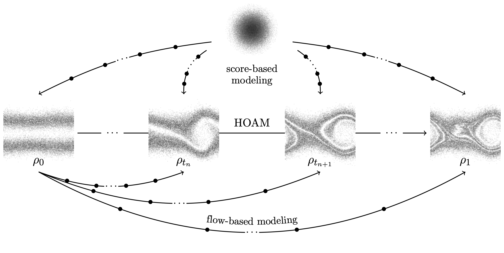
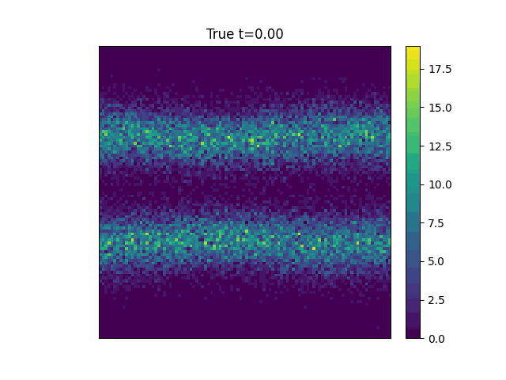
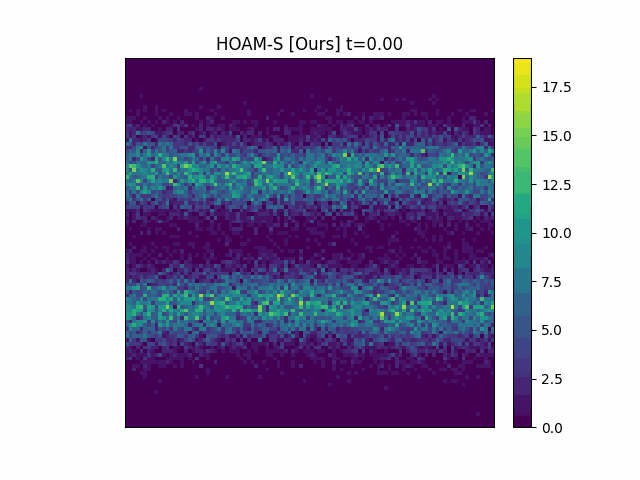

<div align="center">

</div>


# Parametric model reduction of mean-field and stochastic systems via higher-order action matching [HOAM]
Neurips 2024

[**Setup**](#setup)
| [**Results**](#results)
| [**Cite**](#cite)
| [**Additional References**](#additional-references)

The aim of this work is to learn models of population dynamics of physical systems that feature stochastic and mean-field effects and that depend on physics parameters. The learned models can act as surrogates of classical numerical models to efficiently predict the system behavior over the physics parameters. Building on the Benamou-Brenier formula from optimal transport and action matching, we use a variational problem to infer parameter- and time-dependent gradient fields that represent approximations of the population dynamics. The inferred gradient fields can then be used to rapidly generate sample trajectories that mimic the dynamics of the physical system on a population level over varying physics parameters. We show that combining Monte Carlo sampling with higher-order quadrature rules is critical for accurately estimating the training objective from sample data and for stabilizing the training process. We demonstrate on Vlasov-Poisson instabilities as well as on high-dimensional particle and chaotic systems that our approach accurately predicts population dynamics over a wide range of parameters and outperforms state-of-the-art diffusion-based and flow-based modeling that simply condition on time and physics parameters. 

## Setup
This code was all developed with:
`
python3.11
`


First locally install the hoam package with

```bash
pip install --editable .
```

Install all additional required packages run:

```bash
 pip install -r requirements.txt
```

Lastly ensure that jax is installed with the appropriate CPU or GPU support depending on where you plan to run this code. Info on installing with GPU suport can be found: [here](https://github.com/google/jax#installation)


Then you should be able to run the included notebooks:

- oscillator.ipynb
- vlasov.ipynb

Each of these notebooks should be easily runnable from top to bottom in order to produce the results show below

## Results
The Vlasov equation describes the motion of collisionless charged particles under the influence of an electric
field. We compare HOAM to ground truth:

<span>



</span>
<!-- 
<span>


</span> -->

<br>

## Cite
[Parametric model reduction of mean-field and stochastic systems via higher-order action matching](https://arxiv.org/abs/2410.12000)

[Neurips 2024 Poster](https://neurips.cc/virtual/2024/poster/93463)

## Additional References

For details about the JAX, [reference documentation](https://jax.readthedocs.io/).

